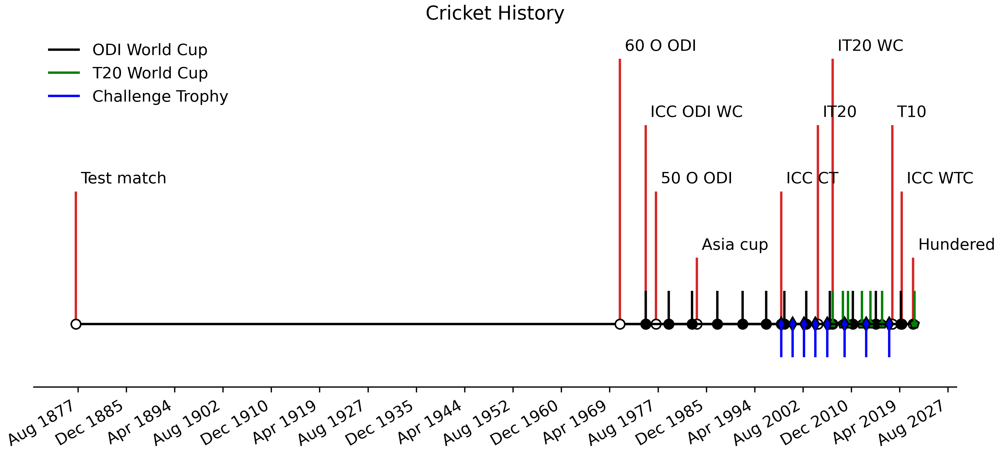
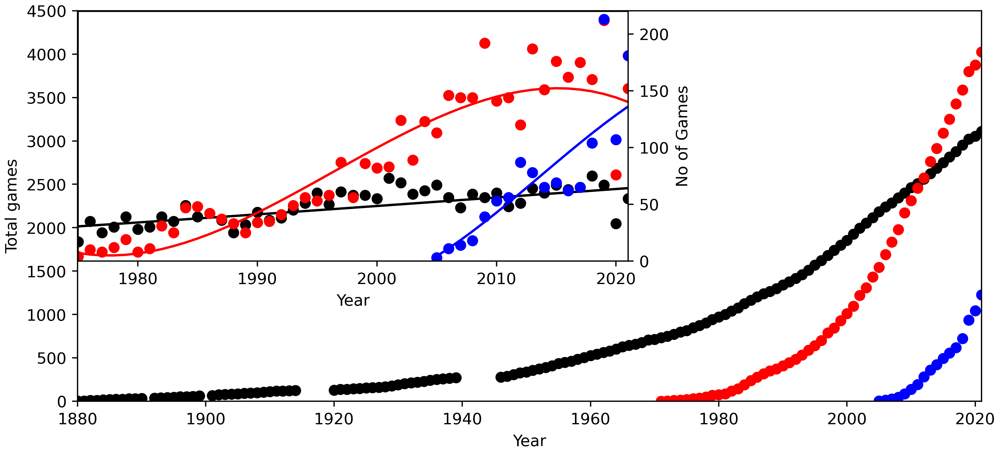
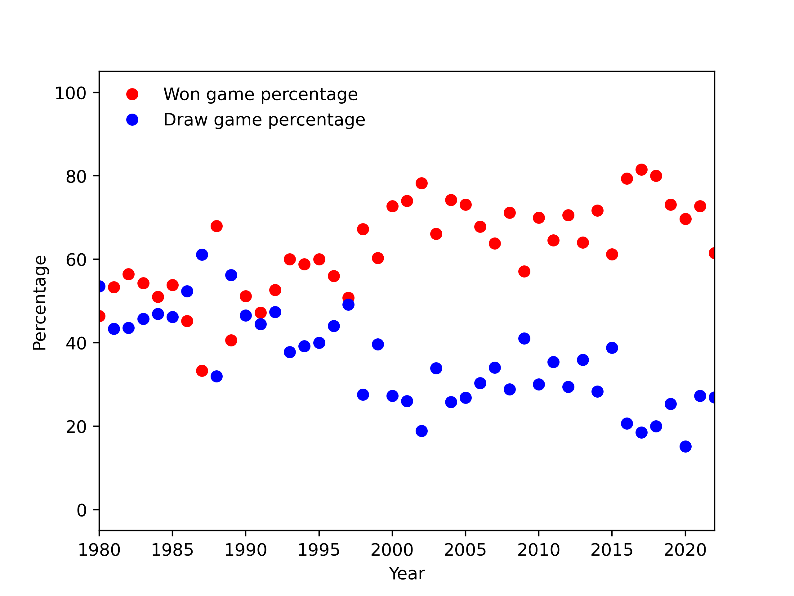

## **Cricket**

### **What is cricket?**

**Cricket** is a bat-and-ball game played between two teams of eleven players each on a field at the centre of which is a 22-yard (20-metre) pitch with a wicket at each end, each comprising two bails balanced on three stumps. The game proceeds when a player on the fielding team, called the **bowler**, "bowls" (propels) the ball from one end of the pitch towards the wicket at the other end, with an "over" being completed once they have legally done so six times. The batting side has one player at each end of the pitch, with the player at the opposite end of the pitch from the bowler aiming to strike the ball with a bat. The batting side scores runs either when the ball reaches the boundary of the field, or when the two batters swap ends of the pitch, which results in one run. The fielding side's aim is to prevent run-scoring and dismiss each batter (so they are "out", and are said to have "lost their wicket"). Means of dismissal include being bowled, when the bowled ball hits the stumps and dislodges the bails, and by the fielding side either catching a hit ball before it touches the ground, or hitting a wicket with the ball before a batter can cross the crease line in front of the wicket to complete a run. When ten batters have been dismissed, the innings ends and the teams swap roles. The game is adjudicated by two umpires, aided by a third umpire and match referee in international matches. [Link source](https://en.wikipedia.org/wiki/Cricket)

### **Scoring**
The batters can run after the ball is hit. A run is scored each time they change places on the pitch. The team with the highest number of runs (typically in the hundreds) wins the match.
1. **6 runs**: A ball hit out of the field on a fly.
2. **4 runs**: A ball hit out of the field on a bounce.

### **Dismissals**
1. **Bowled out**: Bowler knocks over (breaks) the wicket with a bowl.
2. **Caught out**: Fielder catches a batted ball on the fly
3. **Run out**: Fielder catches ground ball and throws it at the wicket, knocking it down before the batsman gets there.
4. **Leg before wicket**: Batsman's body interferes with a bowled ball that would hit the wicket.

## **History**
**Cricket** is the world's second most popular spectator and second most viewed sport. It had orginated from the South-east England during 16th century. Cricket was introduced to North America via the English colonies in the 17th century, probably before it had even reached the north of England. In the 18th century it arrived in other parts of the globe. It was introduced to the West Indies by colonists and to India by East India Company mariners in the first half of the century. It arrived in Australia almost as soon as colonisation began in 1788. New Zealand and South Africa followed in the early years of the 19th century. It became an established sport in the country in the 18th century and developed globally in the 19th and 20th centuries. [link source](https://en.wikipedia.org/wiki/History_of_cricket)

The game has evolved from timeless Test matches to 100 balls game and it has over of 

